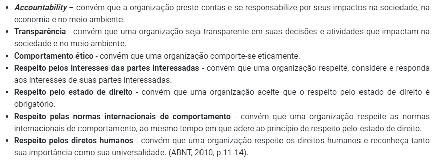
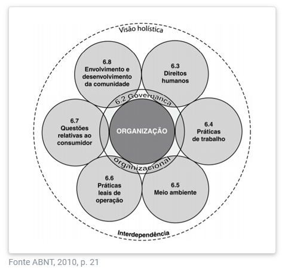
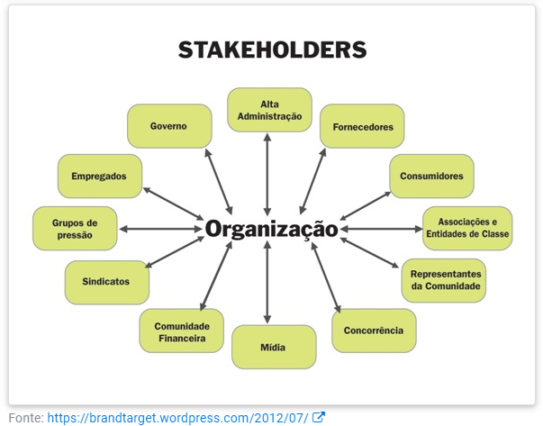

# **UNIDADE 2**

## Sustentabilidade

O conceito de desenvolvimento sustentável foi criado em 1987 no documento “Nosso Futuro Comum”, da Comissão Mundial sobre Meio Ambiente e Desenvolvimento (CMMAD) da Organização das Nações Unidas:

> “[...] aquele que atende às necessidades do presente sem comprometer a possibilidade de as futuras gerações atenderem as suas próprias necessidades”

- Tripé:
    - economico
    - social
    - ambiental
- uso racional de recursos
- equilibrio de ecossistemas
- melhoria da qualidade de vida
- impactos sociais do empreendimento - agir com ética
    - preservação ambiental e cultural
    - respeito à diversidade
    - redução de desigualdades sociais

### RESPONSABILIDADE SOCIAL
- iniciou na área de negocios
- se espalhou para outros empreendimentos
- não é filantropia/ação isolada

> Responsabilidade social empresarial é a forma de gestão que se define pela relação ética e transparente da empresa com todos os públicos com os quais ela se relaciona e pelo estabelecimento de metas empresariais que impulsionem o desenvolvimento sustentável da sociedade, preservado recursos ambientais e culturais para as gerações futuras, respeitando a diversidade e promovendo a redução das desigualdades sociais. (NAJBERG, 2014, p. 120)

- 7 princípios:

<fig>Princípios da Responsabilidade Social</fig>

- Temas Centrais:

<fig>Temas Centrais da Responsabilidade Social</fig>

- governança organizacional: toma e implementa decisões e trata de todos os outros temas

### IMPACTO AMBIENTAL

> considera-se impacto ambiental qualquer alteração das propriedades físicas, químicas e biológicas do meio ambiente, causada por qualquer forma de matéria ou de energia resultante das atividades humanas [...](IBAMA, 1986).

- ações mitigadoras: medidas compensatórias
- conservação ambiental: uso racional de recursos
- Pegada ecológica: indicador de impacto ambiental
    - impacto destrutivo do ser humano
    - ser humano ultrapassa os limites de autocura do planeta
    - traduz o espaço utilizado por pessoa/país para se sustentar, em hectares
- gestão ambiental: planejamento e execução de ações que visam a qualidade ambiental por meio da redução e a prevenção de impactos negativos
    - controle de poluição: segue a lei
    - redução de poluição: utiliza recursos de forma eficiente
    - abordagem estratégica: conservação ambiental e se coloca à frente da concorrência
- SGA - Sistema de Gestão Ambiental
    - norma NBR ISO 14001

## ÉTICA

- Conceito de Kant:
    - algo pode ser dito como ético se a pessoa se guia por uma máxima que não lhe incomodaria se esta se tornasse uma lei universal. Isto é, se todas as pessoas agissem como ela agiu, isso continuaria a ser bom para ela e para todos.
- qual o objetivo da empresa na sociedade?
    - gerar lucro - foco na utilidade e rentabilidade
    - melhoria de vida comunitária e respeito ao meio ambiente
- consumidores hoje em dia estão cada vez mais conscientes

<fig>Stakeholders de dua organização</fig>

- Código de conduta e ética profissional
    - como se portar, o que é aceito ou não
    - comportamento e postura nos diversos relacionamentos dentro da organização

## HABILIDADES E COMPETENCIAS EMPREENDEDORAS
### CRITIVIDADE E INOVAÇÃO

