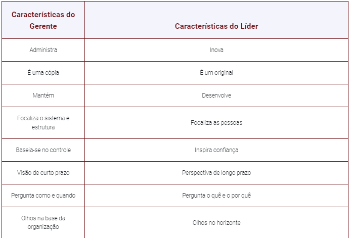
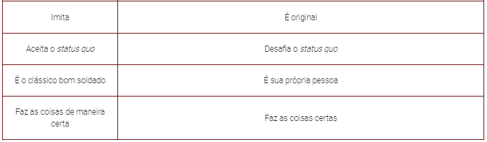
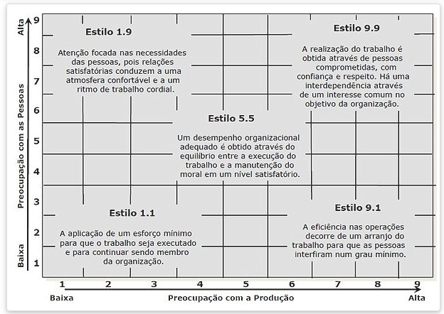
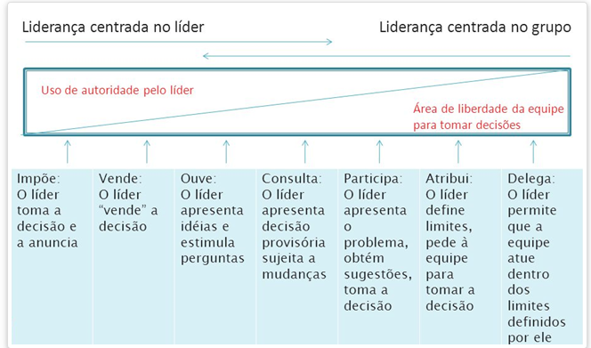

# **UNIDADE 3**

## LIDERANÇA

- já foi uma forma de controle, com foco no trabalho
- hoje em dia: conduz ações, influencia o comportamento e a mentalidade de outras pessoas e estabelece metas direcionando indivíduos

<fig>Diferenças entre Gerentes e Líderes</fig>

- características:
    - liderança é relacional - estar líder, não ser líder
    - ligada à influência
    - necessita aceitação
- constituição de um grupo
    - Formação, quando são definidos o seu propósito, estrutura e liderança
    - Tormenta, quando os membros aceitam o grupo, mas resistem ao controle exercido à sua individualidade.
    - Normalização, aqui começa a criação de uma identidade grupal e surge a camaradagem.
    - Desempenho, a estrutura do grupo torna-se funcional e aceita, e o desempenho cresce.
- o líder de uma equipe possivelmente terá que enfrentar situações de conflitos na equipe
    - tipos de conflito:
        - tarefa
        - relacionamento
        - processos

### TEORIA DOS TRAÇOS

- personalidade do líder
    - extroversão
    - amabilidade
    - conscienciosidade/confiabilidade
    - estabilidade emocional
    - abertura para experiências
- ajuda a prever o surgimento de um líder

### TEORIAS COMPORTAMENTAIS

- na dec. 30
    - autocrática - centralizada, dominadora
    - liberal - participação mínima, não regula
    - democratica - diretrizes debatidas pelo grupo, orientação e condução
- na dec. 40
    - centrada no empregado - mais produtivo
    - centrada na produção
- atual - grade de liderança
    

<fig>Grade de liderança</fig>

9.9 gestão de equipes

1.9 clube de campo

5.5 meio caminho

9.1 autoridade-submissão

1.1 gestão pobre

### TEORIAS SITUACIONAIS

- força do lider: caracteristicas pessoais
- forças dos subordinados: desejo de autonomia e participação
- forças da situação: estrutura, cultura, clima
- continuum: 

<fig>Continuum de Liderança</fig>

### TEORIA DA CONTINGÊNCIA EM LIDERANÇA DE FIEDLER

- EPC - escala de preferência do colaborador
    - as pessoas descrevem com quem gostariam de trabalhar
    - liderança orientada para relações - pontuação alta
    - liderança orientada para tarefa - pontuação baixa
- variáveis:
    - se há ou não apoio ao líder
    - compreensão quanto aos objetivos das tarefas, procedimentos e orientações
    - autoridade do líder para recompensar ou punir
- para funcionar precisa da consciencia do proprio líder sobre seu tipo de liderança

### TEORIA DA META E DO CAMINHO DE ROBERT HOUSE

- uma das mais respeitadas tecnicas
- líderes seriam pessoas capazes de abrir caminhos e reduzir os obstáculos para a atuação de seus liderados
- 4 tipos:
    - 
<fig>4 tipos de liderança na Teoria da meta</fig>
- 2 variáveis:
    - variáveis contingenciais ambientais: fora do controle do lider
    - variáveis contingenciais do funcionário: centro de controle
 
### Teoria da Liderança Situacional (TLS) de Hersey e Blanchard

- foco está nos liderados
- a eficácia da liderança depende da aceitação do líder pelos liderados
- o líder deve reduzir o seu controle na medida em que são criados laços de confiança e os liderados são mais responsáveis

### NEGOCIAÇÃO NA TOMADA DE DECISÕES

- acordo entre duas ou mais partes, mas sem a mediação de uma terceira pessoa, em busca de um objetivo
- abordagens:
    - negociação distributiva, mais tradicional do tipo ganha-perde, em que o bolo é fixo
    - negociação integradora, com soluções do tipo ganha-ganha, em que são criadas várias opções

### GESTÃO DE CRISES

- Crise é um acontecimento que envolve falhas, que gera aflição geral, situações de desgaste de relacionamentos
    - Vem muito por problemas de gestão
    - pode gerar um momento de oportunidade
- Prever os principais riscos e ameaças à organização e se antecipar na solução destes problemas
- identificação dos riscos, que devem ser listados, quantificados e devem mensurar a probabilidade de ocorrência e o grau de gravidade
    - Quando não for possível eliminar o risco, o empreendedor deve planejar ações corretivas

## FORMAÇÃO E DESENVOLVIMENTO PROFISSIONAL

- a universidade deve estimular o contato do estudante com os empreendedores, por meio de estágios, palestras, programas de mentoria, criação de empresas juniores, realização de editais para o fomento de projetos empreendedores, dentre outros
> disciplina de empreendedorismo é parte do currículo de todos os cursos e são frequentadas por estudantes de diferentes cursos. Isso permite que você possa conhecer estudantes de outras áreas de formação, com diferentes visões, fomentando a interdisciplinaridade e as possibilidades de futuras sociedades e parcerias.
- A maioria dos empreendedores universitários oferece um produto já existente no mercado nacional ou regional ou realiza um aprimoramento de um produto já existente. Poucos são os que possuem um produto novo no mercado nacional ou no mercado mundial.
- Empreender significa enfrentar desafios parecidos a trocar o pneu do carro enquanto ele está rodando.
- 
